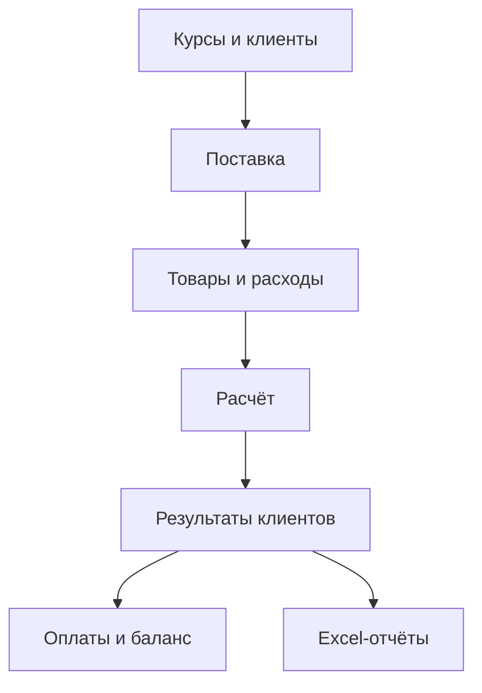

# China Calc

<div align="center">

### Веб-приложение для расчёта поставок товаров из Китая

**Закупка, логистика, расходы, комиссии, оплаты клиентов и отчёты — в одном сервисе.**

[](https://www.python.org/)
[](https://www.djangoproject.com/)
[](https://www.postgresql.org/)
[](https://getbootstrap.com/)
[](https://www.docker.com/)

[О проекте](#о-проекте) •
[Возможности](#возможности) •
[Расчёты](#логика-расчёта) •
[Docker](#быстрый-запуск-через-docker) •
[Локальный запуск](#локальный-запуск) •
[Тесты](#тесты-и-проверка-кода)

**[Открыть China Calc](https://chinacalc.online/)**

</div>


## О проекте

**China Calc** — Django-приложение для байеров, перевозчиков и специалистов,
которые организуют закупку и доставку товаров из Китая в Россию и Беларусь.

Сервис заменяет ручные таблицы: хранит товары разных клиентов, рассчитывает
закупочную и клиентскую стоимость по разным курсам, распределяет логистику и
расходы, начисляет комиссию байера и показывает итог по каждому клиенту.
Результат можно выгрузить в индивидуальный Excel-отчёт.

## Возможности

- регистрация и авторизация по электронной почте;
- разделение данных между пользователями;
- управление клиентами и их индивидуальной комиссией;
- создание поставок с товарами нескольких клиентов;
- маршруты Китай → Россия, Китай → Беларусь и Китай → Россия → Беларусь;
- расчёт логистики по весу или объёму;
- внутренние курсы для себестоимости и отдельные курсы для клиента;
- поддержка CNY, USD, RUB и BYN;
- прямые расходы на конкретный товар и общие расходы на поставку;
- пропорциональное распределение логистики и общих расходов;
- история расчётов с одним актуальным результатом;
- учёт оплат, задолженности и переплаты клиента;
- Excel-отчёт для каждого клиента с кликабельными ссылками на товары;
- адаптивный русскоязычный интерфейс на Bootstrap 5.

## Как это работает



1. Пользователь задаёт внутренние и клиентские курсы валют.
2. Добавляет клиентов и указывает процент комиссии байера.
3. Создаёт поставку, выбирает маршрут, тариф и способ расчёта логистики.
4. Добавляет товары и дополнительные расходы.
5. Запускает расчёт поставки.
6. Фиксирует оплаты и скачивает отчёты для клиентов.

## Интерфейс

<table>
  <tr>
    <td width="50%" align="center">
      <strong>Список поставок</strong><br><br>
      
    </td>
    <td width="50%" align="center">
      <strong>Результат расчёта</strong><br><br>
      
    </td>
  </tr>
  <tr>
    <td width="50%" align="center">
      <strong>Клиенты и оплаты</strong><br><br>
      
    </td>
    <td width="50%" align="center">
      <strong>Курсы валют</strong><br><br>
      
    </td>
  </tr>
</table>

## Логика расчёта

### Стоимость товара

```text
себестоимость товара = цена × количество × внутренний курс
стоимость для клиента = цена × количество × клиентский курс
```

Внутренний курс используется для расчёта реальной себестоимости, клиентский —
для формирования итоговой цены клиента.

### Комиссия байера

```text
комиссия = стоимость товаров для клиента × процент комиссии / 100
```

Процент задаётся отдельно для каждого клиента.

### Логистика

```text
по весу   = общий вес поставки × тариф за 1 кг
по объёму = общий объём поставки × тариф за 1 м³
```

Логистика распределяется между товарами пропорционально их весу или объёму.

### Расходы

- прямой расход полностью относится к выбранному товару;
- общий расход распределяется между всеми товарами по базе логистики.

### Итог клиента

```text
итого клиенту = товары + логистика + расходы + комиссия
```

### Оплаты

```text
остаток   = max(итого клиенту − оплачено, 0)
переплата = max(оплачено − итого клиенту, 0)
```

## Маршруты и валюты

| Маршрут | Итоговая валюта | Схема конвертации |
|---|:---:|---|
| Китай → Россия | RUB | исходная валюта → RUB |
| Китай → Беларусь | BYN | исходная валюта → BYN |
| Китай → Россия → Беларусь | BYN | исходная валюта → RUB → BYN |

Поддерживаемые направления курсов: `CNY → BYN`, `CNY → RUB`, `USD → BYN`,
`USD → RUB` и `RUB → BYN`.

## Технологии

| Назначение | Технология |
|---|---|
| Backend | Python 3.14, Django 6.0 |
| База данных | PostgreSQL 17 |
| Интерфейс | Django Templates, Bootstrap 5, Crispy Forms |
| Excel-отчёты | OpenPyXL |
| Зависимости | Poetry |
| Контейнеризация | Docker, Docker Compose |
| Production | Gunicorn, Caddy, HTTPS |
| Тестирование | Django TestCase, pytest-django |
| Качество кода | Ruff |

## Архитектура

Расчётная логика отделена от HTTP-представлений. Отдельные калькуляторы
выполняют конкретные вычисления, а сервисный слой объединяет их в полный
сценарий расчёта поставки.

```text
ChinaCalcProject/
├── src/
│   ├── china_calc/
│   │   ├── account/          # пользователи, регистрация и авторизация
│   │   ├── client/           # клиенты и комиссия байера
│   │   ├── shipment/         # поставки, товары и расходы
│   │   ├── finance/          # курсы, расчёты и оплаты
│   │   │   ├── calculators/  # отдельные этапы вычислений
│   │   │   └── services/     # сценарии расчёта
│   │   └── reports/          # формирование Excel-отчётов
│   ├── config/               # настройки Django
│   └── manage.py
├── templates/                # HTML-шаблоны
├── docs/images/              # скриншоты для README
├── compose.yml
├── Dockerfile
├── env.example
├── poetry.lock
└── pyproject.toml
```

## Быстрый запуск через Docker

### Требования

- Git;
- Docker Engine с Docker Compose или Docker Desktop.

### 1. Клонируйте репозиторий

```bash
git clone https://github.com/Dimaarti/Project_TMS.git
cd Project_TMS
```

### 2. Создайте файл окружения

```bash
cp env.example .env
```

Пример `.env` для разработки:

```env
SECRET_KEY=replace-with-a-long-random-secret-key
DEBUG=True
ALLOWED_HOSTS=localhost,127.0.0.1,testserver
LANGUAGE_CODE=ru
TIME_ZONE=Europe/Minsk

PG_HOST=postgresql_db
PG_USER=postgres
PG_PASS=postgres
PG_NAME=china_calc
PG_PORT=5432
PG_TEST_NAME=test_china_calc
```

Файл `.env` содержит секретные данные и не должен попадать в Git.

### 3. Соберите и запустите контейнеры

```bash
docker compose up --build
```

После запуска приложение будет доступно по адресу
<http://127.0.0.1:8000/>.

### 4. Создайте администратора

В отдельном терминале:

```bash
docker compose exec web python src/manage.py createsuperuser
```

Полезные команды:

```bash
docker compose ps
docker compose logs -f web
docker compose down
```

Удаление контейнеров вместе с локальными данными PostgreSQL:

```bash
docker compose down -v
```

> Команда с `-v` безвозвратно удаляет Docker-том базы данных.

## Локальный запуск

### Требования

- Python 3.14;
- Poetry;
- PostgreSQL;
- Git.

### 1. Установите проект

```bash
git clone https://github.com/Dimaarti/Project_TMS.git
cd Project_TMS
python -m pip install poetry
poetry install --no-root
```

### 2. Подготовьте окружение

```bash
cp env.example .env
```

Для локального PostgreSQL укажите:

```env
SECRET_KEY=replace-with-a-long-random-secret-key
DEBUG=True
ALLOWED_HOSTS=localhost,127.0.0.1,testserver
LANGUAGE_CODE=ru
TIME_ZONE=Europe/Minsk

PG_HOST=127.0.0.1
PG_USER=postgres
PG_PASS=your-postgresql-password
PG_NAME=china_calc
PG_PORT=5432
PG_TEST_NAME=test_china_calc
```

### 3. Примените миграции и запустите сервер

```bash
poetry run python src/manage.py migrate
poetry run python src/manage.py createsuperuser
poetry run python src/manage.py runserver
```

Откройте <http://127.0.0.1:8000/>.

## Переменные окружения

| Переменная | Назначение | Пример для разработки |
|---|---|---|
| `SECRET_KEY` | секретный ключ Django | длинная случайная строка |
| `DEBUG` | режим отладки | `True` |
| `ALLOWED_HOSTS` | разрешённые хосты | `localhost,127.0.0.1` |
| `LANGUAGE_CODE` | язык интерфейса | `ru` |
| `TIME_ZONE` | часовой пояс | `Europe/Minsk` |
| `PG_HOST` | адрес PostgreSQL | `127.0.0.1` |
| `PG_PORT` | порт PostgreSQL | `5432` |
| `PG_NAME` | имя базы | `china_calc` |
| `PG_USER` | пользователь PostgreSQL | `postgres` |
| `PG_PASS` | пароль PostgreSQL | задаётся локально |
| `PG_TEST_NAME` | имя тестовой базы | `test_china_calc` |

## Тесты и проверка кода

```bash
# Проверка конфигурации Django
poetry run python src/manage.py check

# Все тесты
poetry run python src/manage.py test china_calc

# Проверка миграций
poetry run python src/manage.py makemigrations --check --dry-run

# Линтинг и форматирование
poetry run ruff check src
poetry run ruff format --check src
```

Автоматическое исправление доступных замечаний:

```bash
poetry run ruff check src --fix
poetry run ruff format src
```

## Развёртывание

Production-версия работает по следующей схеме:

```text
Пользователь → Caddy → Gunicorn → Django → PostgreSQL
```

Caddy принимает HTTP/HTTPS-запросы, автоматически управляет TLS-сертификатом,
раздаёт статические и медиафайлы и передаёт динамические запросы в Gunicorn.

Перед production-развёртыванием обязательно:

```bash
poetry run python src/manage.py check --deploy
poetry run python src/manage.py test china_calc
poetry run ruff check src
```

В production должны использоваться отдельные переменные окружения, в том числе
`DEBUG=False`, домен в `ALLOWED_HOSTS` и защищённые cookie.

## Работа с Git

- `dev` — разработка и локальная проверка изменений;
- `main` — стабильная версия, используемая для production-развёртывания.

Обычный рабочий процесс:

```bash
git switch dev
git pull --ff-only origin dev

# После внесения и проверки изменений
git add .
git commit -m "Краткое описание изменений"
git push origin dev
```

После проверки создаётся Pull Request из `dev` в `main`. Production обновляется
только после успешного объединения изменений с веткой `main`.

## Безопасность

- не добавляйте `.env`, пароли и резервные копии базы в Git;
- используйте уникальный `SECRET_KEY`;
- устанавливайте `DEBUG=False` вне локальной разработки;
- храните пароли пользователей только через встроенное хеширование Django;
- ограничивайте выборки объектов текущим авторизованным пользователем;
- выполняйте изменяющие операции через POST-запросы с CSRF-защитой;
- регулярно создавайте резервные копии PostgreSQL.

## Автор

**Дмитрий Артюшенко** — Python Backend Developer.

- GitHub: [Dimaarti](https://github.com/Dimaarti)
- Репозиторий: [Project_TMS](https://github.com/Dimaarti/Project_TMS)

---

<div align="center">

**China Calc — прозрачный расчёт каждой поставки и каждого клиента.**

</div>
